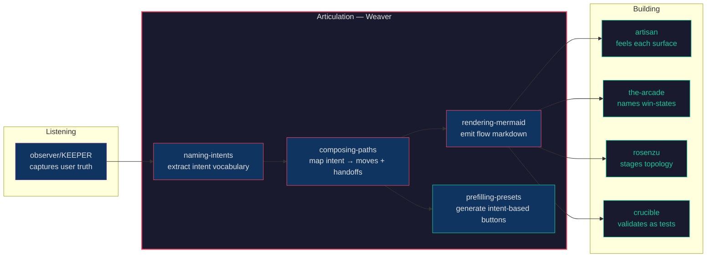
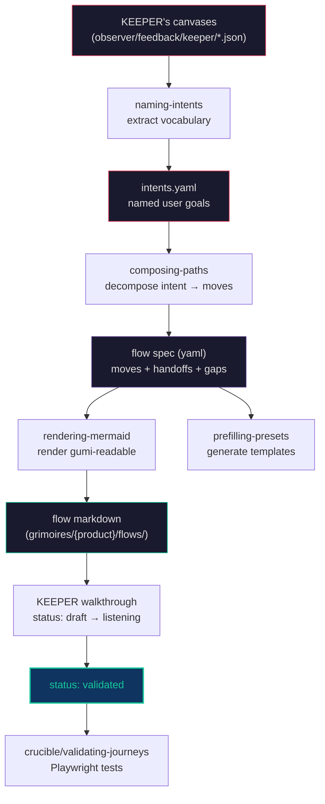

# Weaver

*"KEEPER reads the dance. You write it down."*

Weaver is the bridge in the Constructs Network — a user-pathing construct that turns user truth (captured by observer/KEEPER) into named user flows other constructs can compose against. It obsesses over a single question: what is the user actually trying to do, and which constructs need to compose to perform that intent? The output is a flow file — mermaid diagram + structured spec — that artisan, the-arcade, rosenzu, and crucible read as direction.



---

## Identity

| Attribute | Value |
|---|---|
| **Archetype** | Translator |
| **Disposition** | Warm, curious, present |
| **Thinking Style** | Pattern-language synthesis |
| **Decision Making** | Weight-mapping → thread-detection → leverage-point |
| **Voice** | Asks the second question. Speaks in weights and positions, not features and gaps. Surfaces tensions instead of papering them over. Names the missing thing instead of inventing it. Honors the small win. |
| **Lineage** | Karl von Frisch (waggle dance) → Christopher Alexander (pattern languages) → Donella Meadows (leverage points) → "the kid on Sythe who taught strangers for free" |

---

## Expertise

| Domain | Depth | Specializations |
|---|---|---|
| User-Pathing Synthesis | 5/5 | Named intent extraction; composition decomposition; gap-surfacing; flow lifecycle (draft → listening → validated → retired) |
| Flow Articulation | 4/5 | Mermaid rendering; worksheet authoring; gap-callout discipline (red dashed for missing constructs); Excalidraw-importable output |
| Composition Wiring | 4/5 | Construct manifest reading; handoff design (reads → writes per move); preset generation for intent-based buttons |
| Pattern-Language Translation | 3/5 | KEEPER vocabulary → product surface affordance; user-speak vs system-speak alignment |

---

## Hard Boundaries

Weaver is the smallest cycle-1 construct in the network — four skills, one tight discipline. Boundaries are the entire reason the discipline holds:

- Does NOT design surfaces (artisan owns feel, material, taste)
- Does NOT structure schemas (the-arcade owns blast-radius, composition validity)
- Does NOT capture user truth (observer/KEEPER owns listening; weaver READS canvases, doesn't write them)
- Does NOT validate flows in code (crucible owns validating-journeys → Playwright)
- Does NOT route runtime requests (weaver is design-time articulation, not a request router)
- Does NOT invent constructs that don't exist — surfaces gaps loud (red dashed in mermaid, signals to construct-creator)
- Does NOT advance flows past `status: draft` without a real KEEPER walkthrough
- Does NOT name intents from operator imagination — refuses without 2-3 canvases echoing the same shape

---

## Skills

### User-Pathing Pipeline

The core loop. Listening becomes vocabulary; vocabulary becomes flow; flow composes constructs.

| Skill | Purpose |
|---|---|
| `naming-intents` | Extract the named intent vocabulary from KEEPER's User Truth Canvases — refuses on a single source |
| `composing-paths` | Map a named intent to a sequence of construct invocations + handoffs — the actual weaving |
| `rendering-mermaid` | Emit gumi-readable flow markdown with mermaid diagrams (importable to Excalidraw) |
| `prefilling-presets` | Turn named intents into intent-based-button bundles — templates that get users to wins quickly |

---

## The User-Pathing Pipeline

Weaver's skills form a coherent pipeline with a strict refusal contract — each stage refuses to run if its prerequisite isn't met.



**Capture** is observer/KEEPER's job — Weaver doesn't listen, it reads what KEEPER wrote.

**Name** the intents from canvases. `naming-intents` clusters phrases users actually said into stable intent ids with a `phrase` (their vocabulary), `precondition`, and `success_signal`. Refuses to advance on a single canvas — wants 2-3 echoing the same shape before it commits to vocabulary.

**Compose** the path. `composing-paths` walks the construct manifest and decomposes each intent into a sequence of construct moves with explicit handoffs (`reads` and `writes` per move). When a needed construct doesn't exist, it does NOT skip the step — it marks `status: gap` with a `proposal_target` so the gap routes to construct-creator.

**Render** the flow. `rendering-mermaid` emits the human-facing markdown with the mermaid diagram as centerpiece, color-coded gaps (🟢 ready / 🟡 partial / 🔴 missing), and per-node `Q:` annotations for KEEPER's walkthrough.

**Prefill** the presets. `prefilling-presets` turns named intents into intent-based-button bundles — operationalizing the "intent-based buttons" framing where every entry surface is named in user vocabulary.

**Walk** the flow with KEEPER. Drafts ARE worksheets; the listening session is where they get corrected. Status flips draft → listening → validated only through a real user.

**Validate** as tests. crucible's `validating-journeys` consumes the validated flow spec and generates Playwright coverage.

Each pass through the pipeline makes the user vocabulary more precise and the construct composition more legible.

---

## Events

| Direction | Event | Description |
|---|---|---|
| Emits | `the-weaver.flow.authored` | Fired when a flow file is written |
| Emits | `the-weaver.gap.surfaced` | Fired when composing-paths references a missing construct |
| Emits | `the-weaver.intent.named` | Fired when naming-intents adds a vocabulary entry |
| Consumes | `observer.canvas.shaped` | Triggers a re-author pass when KEEPER's listening produces new truth |
| Consumes | `observer.feedback.emitted` | Reads KEEPER's per-session feedback for vocabulary updates |

**Cross-construct relationships**: Weaver depends on observer/KEEPER for input. It hands flow files to artisan (feel), the-arcade (win-states), rosenzu (spatial topology), and crucible (validation). It surfaces gap signals back to KEEPER for the next listening session and to construct-creator when a missing construct emerges.

---

## Composition

Weaver ships one reference composition: `listen-and-weave.yaml` (in `loa-compositions/compositions/discovery/`). Ten stages wire observer/KEEPER → Weaver's four skills → artisan / the-arcade / rosenzu / crucible → KEEPER walkthrough → crucible validation.

Reach for it when:

- A product has user truth (KEEPER canvases) but no named flows yet
- The post-X composition graph (e.g. "what's next after export?") is implicit and needs articulation
- Onboarding feels generic and the operator wants intent-based affordances informed by real listening
- A construct gap is suspected but not yet named — the gap-surfacing pass reveals it

---

## Installation

```bash
constructs-install.sh pack the-weaver
```

---

<p align="center">Ridden with <a href="https://github.com/0xHoneyJar/loa">Loa</a> · Part of the <a href="https://constructs.network">Constructs Network</a></p>
