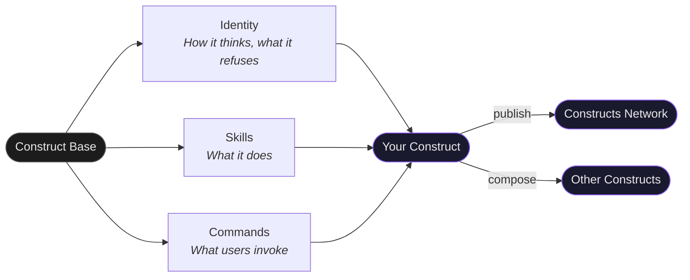

# Construct Base

Your starting build. Everything you need to create, validate, and ship a construct.

```bash
gh repo create my-org/construct-my-expertise \
  --template 0xHoneyJar/construct-template --private --clone
cd construct-my-expertise
```

The base ships with a working construct (Code Review Assistant) — not empty scaffolding. Read it, then make it yours.

---

## Quick Start

Edit three files. Push.

1. **`construct.yaml`** — name, slug, author
2. **`skills/example-simple/SKILL.md`** — your skill's instructions
3. **`CLAUDE.md`** — your construct's identity

```bash
git add -A && git commit -m "feat: my first construct" && git push
```

CI validates automatically. Placeholder text is blocked — you can't ship "your-name" or TODO markers.

---

## What's in the Build

```
construct.yaml              # Manifest — name, version, skills, commands
CLAUDE.md                   # Identity — injected when your construct is active
identity/
  persona.yaml              # How it thinks — archetype, cognitive style, voice
  expertise.yaml            # What it knows — domains rated 1-5, hard boundaries
skills/
  example-simple/           # Minimal skill (~30 lines) — direct, focused
  example-full/             # Complete skill (~130 lines) — multi-step workflow
commands/
  example-command.md        # Slash command prompt template
```



---

## Composition

Constructs connect two ways.

### 1. Grimoire paths — filesystem-layer composition

Constructs connect through directories they write to and read from. Declare yours in `construct.yaml`:

```yaml
composition_paths:
  writes:
    - grimoires/my-construct/output/
  reads:
    - grimoires/laboratory/canvases/  # consume observer data
```

The network graph shows these connections automatically. No event bus needed — the filesystem IS the interface.

Your `CLAUDE.md` MUST mirror these paths in a `## What You Connect To` section — operators read CLAUDE.md; the yaml is for the registry. Both must agree.

### 2. Typed streams — in-memory-layer composition (doctrine v5 §17.4)

For in-flight composition (runner pipe chains like `construct-compose.sh feel-audit`), declare the stream types your construct reads and writes:

```yaml
streams:
  reads:
    - Artifact        # file / path / content-addressable
    - Operator-Model  # who the operator is (doctrine §14.2)
  writes:
    - Verdict         # evaluated judgment with severity + evidence
```

Five primitive types: **Signal** (raw observation) · **Verdict** (judgment) · **Artifact** (material) · **Intent** (operator routing signal) · **Operator-Model** (operator knowledge map). The composition runner verifies type compatibility at chain-build time — mismatches fail loud before any stage runs.

See [Composability Guide](https://constructs.network/docs/composition) for patterns.

---

## Two Example Skills

**`example-simple`** — The starter. Trigger, workflow, boundaries. If your skill is one focused action, start here.

**`example-full`** — The methodology. Multi-step workflow, quality gates, error handling. If your skill is a process, start here.

Both follow the same structure: what it is → how it works → the non-obvious insight → boundaries.

---

## Identity

**`persona.yaml`** — The cognitive frame. A Craftsman obsesses over build quality. A Researcher demands evidence. The archetype shapes every decision your construct makes.

**`expertise.yaml`** — Bounded domains with depth ratings (1-5). Be honest. Boundaries are features — what your construct refuses to do builds trust.

**`identity/<HANDLE>.md`** — Persona handles (UPPERCASE filenames, e.g. `ARCHITECT.md`). Operators invoke your construct via `@HANDLE`, `HANDLE`, or case-insensitive matches. See the starter `identity/ARCHITECT.md` for the shape.

**`CLAUDE.md`** — Not documentation. Instructions injected into the AI runtime. Shapes how the agent *thinks*:
- What it sees (the perceptual lens)
- How it works (default behavior)
- What it refuses (hard boundaries)
- What it connects to (grimoire paths — MUST match `construct.yaml`)

---

## CI — Three Levels

| Level | When | What |
|-------|------|------|
| **L0** | Every push | YAML valid, no placeholders, skills exist |
| **L1** | PRs to main | Schema validation, capability metadata, required sections |
| **L2** | Releases | Publishing gate — everything a consumer needs |

Start at L0. Graduate when ready.

---

## Compose

Constructs aren't solo. Declare events and dependencies to build compositions:

```yaml
events:
  emits:
    - type: forge.my-construct.issue_found
  consumes:
    - event: forge.observer.feedback_captured

pack_dependencies:
  - slug: observer
    version: ">=1.0.0"
```

---

## Publish

Push to GitHub. Register at [constructs.network](https://constructs.network). Others install with one command.

### Auto-generated `CONSTRUCT-README.md`

Post-install, Loa's butterfreezone adapter generates a per-pack `CONSTRUCT-README.md` from your `construct.yaml` + skills + identity/. It surfaces:

- Persona handles (linked to `identity/<HANDLE>.md`)
- Skill inventory with frontmatter descriptions
- Command inventory
- Declared streams (reads / writes)
- Grimoire paths you compose through (SEED §12)
- Install instructions

You don't need to maintain that file — run `.claude/scripts/butterfreezone-construct-gen.sh <pack-path>` in a Loa-equipped repo to regenerate. Keep your hand-authored `README.md` for humans; `CONSTRUCT-README.md` is for agents.

---

## Links

- [constructs.network](https://constructs.network) — Marketplace
- [Loa](https://github.com/0xHoneyJar/loa) — Framework
- [Construct Base Docs](https://github.com/0xHoneyJar/construct-template) — This repo

MIT — customize the license in `construct.yaml` for your distribution.
